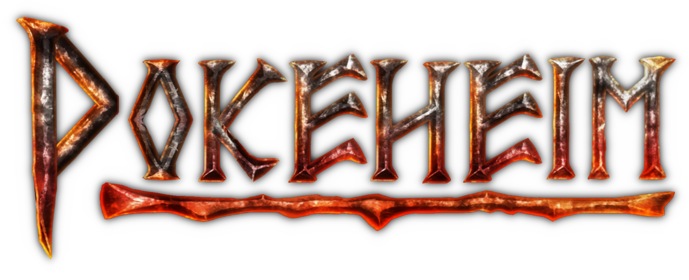

# Pokéheim - A Valheim Mod by Joey Parrish

Source: https://github.com/joeyparrish/pokeheim

> Long ago, the Allfather Odin created the monsters.  No one knows why he did
> this.  Some say he was probably drunk.  Others say he was **surely** drunk.
> In any case, he eventually crammed them all onto a weird, flat planet and
> lost the keys.
>
> For centuries, he actually forgot all about this planet.  The monsters
> enjoyed their world, free from the gods.
>
> When Odin finally remembered the whole monster thing, he decided that
> something had to be done to catch 'em...  all of 'em.  But Odin's always been
> more of an "idea man", so he sent Professor Raven to kidnap you and make
> **you** do it.
>
> He says you "gotta"...
>
> **_WELCOME TO POKEHEIM!_**

## About Pokéheim

Pokéheim is a completely different experience than Valheim.  You don't build
houses, you don't progress through technological stages, and your weapons and
armor don't matter.  You build Pokéballs from rocks and use them to capture
monsters.  Your monsters will then fight other monsters for you, until you've
amassed an army big enough to take on the bosses.

We recommend starting with a fresh character and world.  If you don't, please
make a backup of anything you care about.  It will probably be fine, but better
safe than sorry.

### Dependencies

 - MountUp, v3.2.9
   - We borrow the generic saddle prefab from this mod, and disable the rest.
     We have our own mounting, saddle placement, and riding system in Pokéheim.
 - Jötunn, v2.6.7+
   - The framework on which Pokéheim is built.
 - BepInEx, v5.4+
   - The framework on which Jötunn is built.

### Incompatibilities

 - [AllTameable](https://www.nexusmods.com/valheim/mods/478)
   - Pokéheim has its own way of making monsters Tameable (by capturing them),
     so you should not use it with the AllTameable mod.

### Multiplayer

The server and all players must be using the mod, and everyone must use the
same version of the mod.

## Installation

See [docs/Install.md](https://github.com/joeyparrish/pokeheim/docs/Install.md)

## Translate

Help translate Pokéheim into your language!

See [docs/Translate.md](https://github.com/joeyparrish/pokeheim/docs/Translate.md)

## Building from source

See [docs/Building.md](https://github.com/joeyparrish/pokeheim/docs/Building.md)

## Credits

Pokéheim was created by [Joey Parrish](https://joeyparrish.github.io/).

The authors and contributors of Pokéheim have no affiliation with the Pokémon
Company or Niantic.  This is both a parody and tribute.

### Jötunn

Pokéheim is made possible by
[Jötunn: The Valheim Library](https://valheim-modding.github.io/Jotunn/).
Many thanks to the authors of Jötunn for their wonderful library and their
support on Discord!

### Pokédex Icon

[Pokédex icon](Pokeheim/Assets/Pokedex icon.png) made by
[Roundicons Freebies](https://www.flaticon.com/authors/roundicons-freebies)
from [FlatIcon](https://www.flaticon.com/)

### "Borrowed" Translations

Translations of things like "Pokédex" and "Pokéball" were extracted from the
[Pokémon Go](https://pokemongolive.com/)
[APK](https://www.apkmirror.com/apk/niantic-inc/pokemon-go/).

### Music

Custom music for Pokéheim was arranged by
[Joey Parrish](https://joeyparrish.github.io/), to parody the work of
[Jarlestam](https://www.patrikjarlestam.se/),
[Siegler, and Loeffler](https://en.wikipedia.org/wiki/Pok%C3%A9mon_Theme).

The music was scored in
[Musescore 3.6](https://musescore.org/en/download)
and rendered using the
[Aegean Symphonic Orchestra Soundfont](https://sites.google.com/view/hed-sounds/aegean-symphonic-orchestra).

Special thanks to [TheSlowPianist](https://www.patreon.com/theslowpianist/)
for [their arrangement of the Valheim menu music](https://youtu.be/7bJopufs-80),
which informed the Pokéheim theme.
