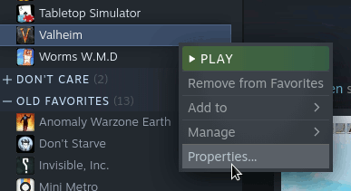
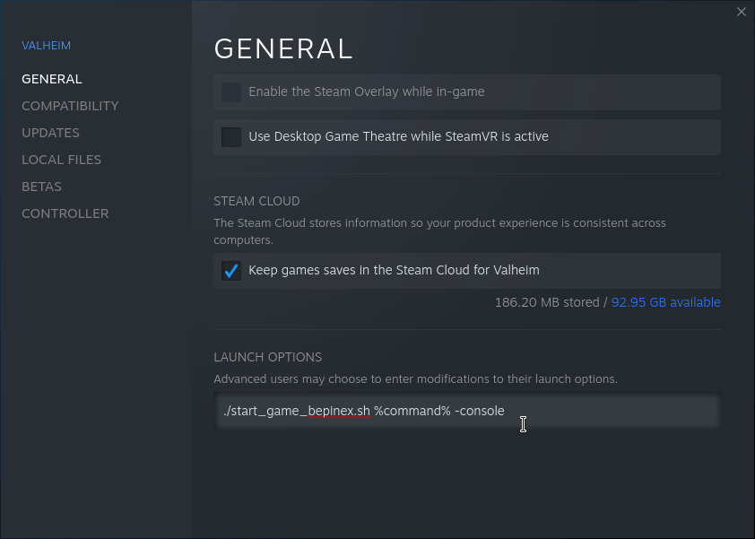
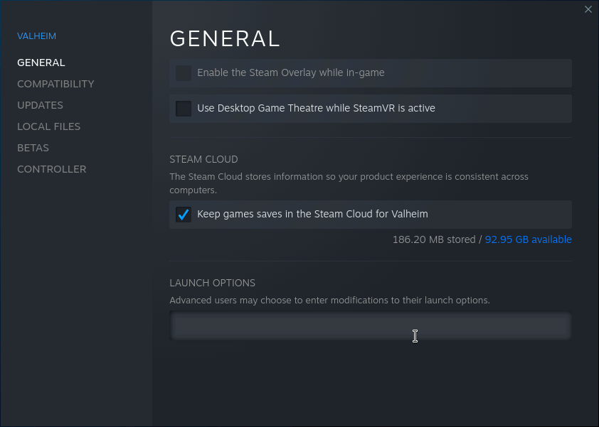

# Configuring Steam with a Wrapper

> :information_source: **NOTE**: For multiplayer games, the server and all
> players must be using the mod, and everyone must use the same version of the
> mod.

Whether you are using a mod manager like R2Modman or manually installing mods,
if you are using Steam, you'll need to configure it to launch the game in a
wrapper.

R2Modman will give you a command to copy to steam.  For manual installation,
use the command:

```sh
./start_game_bepinex.sh %command%
```

You may also wish to add ` -console` to the end of the command to get support
for the debug console:

```sh
./start_game_bepinex.sh %command% -console
```


## Configuring

1. Open Steam
2. Right-click Valheim and open the game's properties:

   

3. Fill in the launch options field with the wrapper command:

   


## Reverting

1. Open Steam
2. Right-click Valheim and open the game's properties:

   

3. Erase the contents of the launch options field:

   
